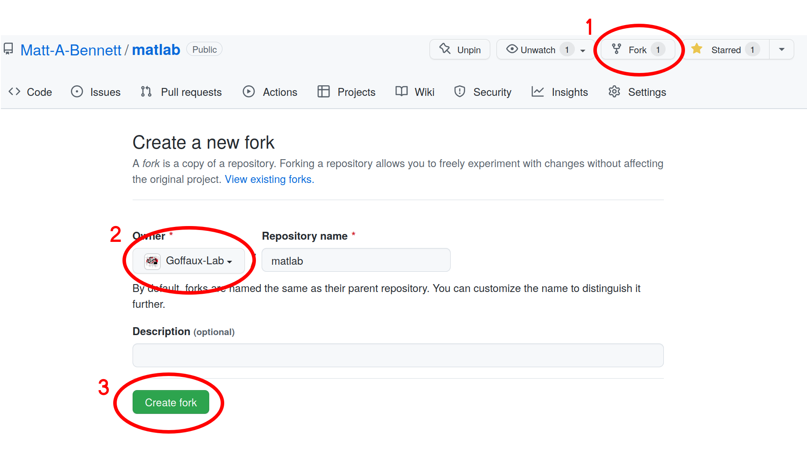
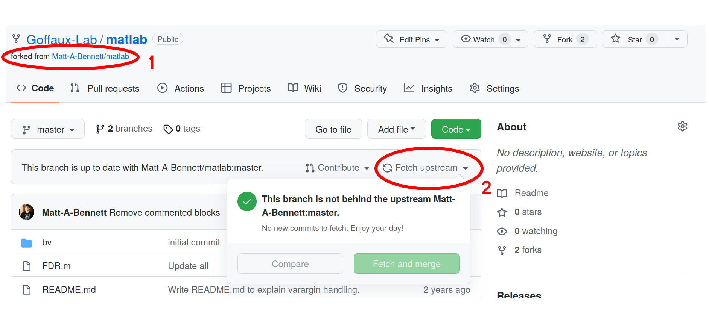
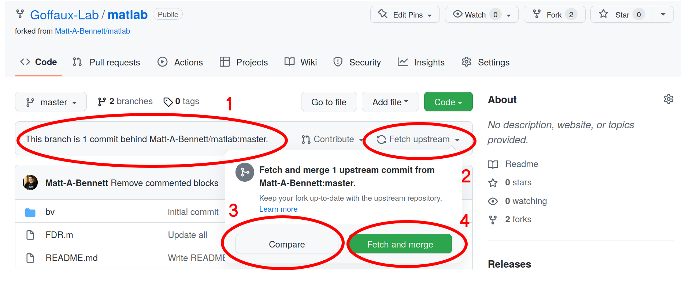
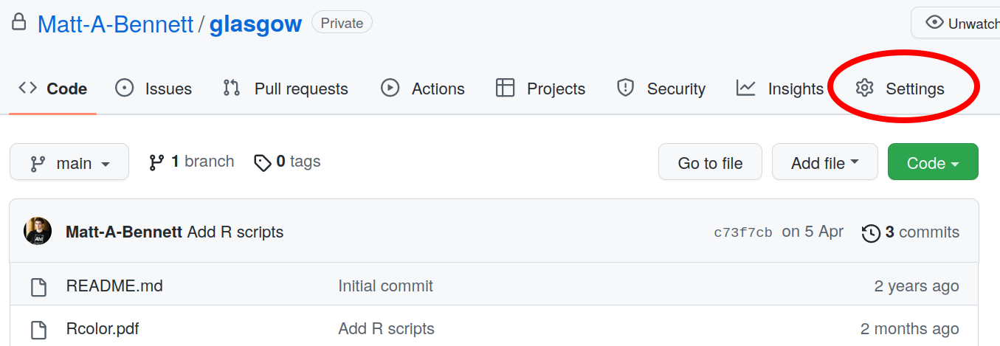
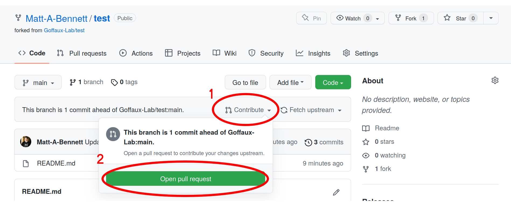
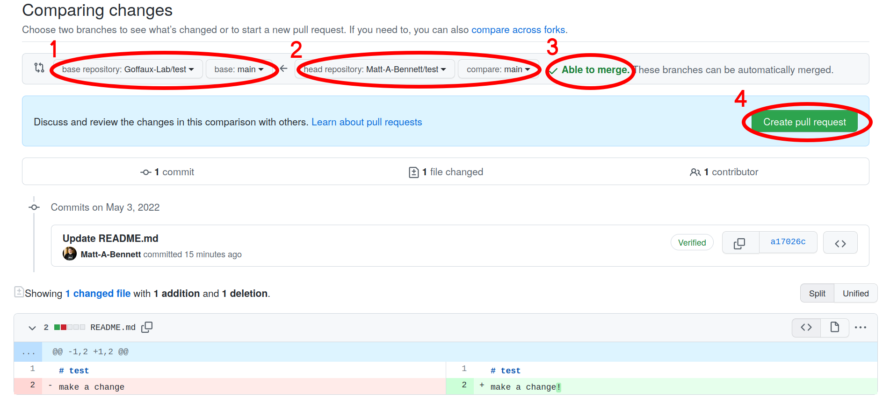

# How to use Goffaux-Lab
## Table of contents
* [General comments](#general-comments)
* [Overview of the workflow](#overview-of-the-workflow)
    * [Sharing your *public* work (fork, commit, fetch upstream)](#sharing-your-public-work-fork-commit-fetch-upstream)
    * [Sharing your *private* work (transfer, fork, commit, pull request)](#sharing-your-private-work-transfer-fork-commit-pull-request)
    * [Using/Updating existing work (fork, commit, pull request)](#usingupdating-existing-work-fork-commit-pull-request)

## General comments
This is the lab's shared github space. We should upload any code and documents
that could be useful for anyone in the lab to be able to use. In the following,
the **bold** words are git specific terms which can be googled to learn more.

The guide assumes you already know how to make changes to a repository on your
own account (i.e. the three stages: add, commit, push) - if you want a guide
for that see
[here](https://github.com/Goffaux-Lab/documentation-and-snippets/blob/main/Git_Github_mini-workshop.pdf).

Github repositories can be private or public. [Deleting your repository or
changing its visibility affects that repository's
forks](https://docs.github.com/en/pull-requests/collaborating-with-pull-requests/working-with-forks/what-happens-to-forks-when-a-repository-is-deleted-or-changes-visibility#changing-a-private-repository-to-a-public-repository).

Fairly obvious: 

On the Goffaux-Lab, private repositories can be seen and used by any member of
the Goffaux-Lab, but not by anyone else. Public repositories can be seen and
used by anyone in the world. 

Not obvious: 

If you delete a private repository, then this will also delete all the private
forks of this repository on others' accounts. To avoid this, you can first
change a repository's visibility from private to public, and then delete it.

## Overview of the workflow 
Github repositories can be **forked** between accounts (i.e. create a copy) so
that others can use them too. The original copy is called the **upstream**. So
you can **fork** a repository from your personal github account to the
Goffaux-Lab account, or **fork** a repository from Goffaux-Lab account to
yours.

On your personal github account you can make changes (or **'commits'**) to the
repositories as you please. These **commits** can easily be synchronised back
to the Goffaux-Lab account by doing **fetch upstream** or by submitting a
**pull request**.

If you're working on a **fork** of a repository from Goffaux-Lab (i.e. you
**forked** it to your personal account), and meanwhile someone makes **commits**
to the repository on the Goffaux-Lab account (i.e. submits a **pull request**
that is accepted), you can easily synchronise your **fork** of the repository
with the updated Goffaux-Lab account (this is called **fetch upstream**).

### Sharing your *public* work (fork, commit, fetch upstream)
Note: This will only work for your *public* repositories. To share a *private*
repository with the lab, see [below](#sharing-your-private-work-fork-transfer-commit-fork-pull-request).
                                      
In order to make one of your personal *public* repositories appear on the
Goffaux-Lab page, go to your *public* repository:

 1. Click the **fork** button.
 2. Make sure the Goffaux-Lab is selected as the destination.
 3. Click 'Create **fork**'.

Once the **fork** has completed, the repository will appear on the Goffaux-Lab
page. Clicking on it we notice some things: 

 1. It shows that the repository was originally forked from your personal
    account (the original repository is the **upstream**).
 2. We have the option to synchronise the **fork** by doing **fetch upstream**.
    This would copy over any new **commits** that have accumulated on the
    original repository since the **fork**.

Immediately after **forking**, there won't be any new **commits**.

If we make a **commit** (i.e. add some more code or fix a bug) in the
**upstream** repository (i.e. on our personal account). Then come back to look
at the **fork** on Goffaux-Lab, we see that:

 1. The repository knows that it is now 1 **commit** behind the **upstream**.
 2. We now have options available with **fetching upstream**.
 3. We can compare the differences between the **fork** and the **upstream**.
 4. Or we can immediately **fetch** those **commits** and **merge** them into
    the **fork** (i.e. synchronise the repositories).

Comparing the files looks like this:

### Sharing your *private* work (transfer, fork, commit, pull request)
Github will not allow us to fork *private* repositories. But we can
**transfer** them over to the Goffaux-Lab account, and then simply **fork** the
repository back to our account. This will make the Goffaux-Lab repository the
**upstream**.

In order to make one of your personal *private* repositories appear on the
Goffaux-Lab page, go to the settings tab on your *private* repository:

Scroll down to the bottom of the page and do the following:

 1. Click on the 'transfer' button .
 2. Type 'Goffaux-Lab' as the place to transfer the repository to.
 3. Type whatever it tells you to confirm.
 4. Finalise the transfer.

Once the above is complete, the repository will appear on the Goffaux-Lab's
github account and not on your personal account. The last thing to do is to
**fork** the repository so that you have a copy on your personal account. This
is detailed in the section below.

### Using/Updating existing work (fork, commit, pull request)
If you want to use a repository that someone else created on Goffaux-Lab, go to
the repository and **fork** it to your personal account. You will probably want
to **clone** the repository from your own account onto your local machine
(unless you are following the steps from the last section, in which case you
may already have a local clone). You are now free to make **commits** to your
**fork** of the repository.

Once you've made some new **commits** to the **fork** that improve the version
that is on Goffaux-Lab, you might like to share it with the lab. To do this you
must request that the **commits** are synchronised back to the **upstream** on
Goffaux-Lab. This is done with a **pull request**:

 1. Click the 'contribute' button.
 2. Click 'open pull request'.

Doing the above takes you to a new page where you can prepare your **pull
requests**. In this example:

 1. It says the name of the **base repository** that we are making our
   **pull request** to.
 2. It says the name of the **head repository** containing the new commits.
 3. It says if the new **commits** are able to be automatically **merged** into
    the **base repository\***.
 4. We click 'Create **pull request**'.

**\*** If an automatic **merge** is not possible, it means that someone else
has submitted a **pull request** with a **commit** that changes some part of
the code that your **pull request** also changes. You can still make the **pull
request**, it just means that the owner of the Goffaux-Lab who accepts/rejects
the **pull request** would additionally have to decide which of the conflicting
changes to incorporate.

We are then allowed to:

 1. Give the request a meaningful title.
 2. Add a longer description of what changes we have made.
 3. Finalise the request.

Later, the owner of Goffaux-Lab will review and accept the **pull request**.
After this is done, the whole lab will have access to your changes.
