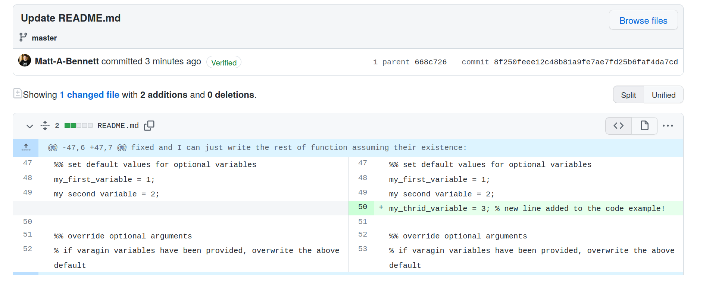

# How to use Goffaux-Lab
This is the lab's shared github space. We should upload any code and documents
that could be useful for anyone in the lab to be able to use. In the following,
the **bold** words are git specific terms which can be googled to learn more.

## Overview of the workflow Github repositories can then be **forked** between
accounts (i.e. create a copy) so that others can use them too. The original
copy is called the **upstream**. So you can **fork** a repository from your
personal github account the Goffaux-Lab account, or **fork** a repository from
Goffaux-Lab account to yours.

On your personal github account you can make changes (or **commits**) to the repositories as you
please. These **commits** can easily be synchronised back to the Goffaux-Lab
account submitting a **pull request**.

If you're working on a **fork** of a repository on your personal account, and
meanwhile someone makes **commits** to the repository on the Goffaux-Lab account
(i.e. submits a **pull request** that is accepted), you can easily synchronise
your **fork** of the repository with the updated Goffaux-Lab account (this is
called **fetch-upstream**).

### Sharing your work (fork, commit, fetch-upstream)

In order to make one of your personal repositories appear on the Goffaux-Lab
page, go to your repository:

 1. Click the **fork** button
 2. Make sure the Goffaux-Lab is selected as the destination
 3. Click 'create fork'

Once the **fork** has completed, the repository will appear on the Goffaux-Lab
page. Clicking on it we notice some things: 

 1. It displays that the repo was originally forked from your personal account
    (the original repository is the **upstream**).
 2. We have the option to synchronise the **fork** by doing **fetch upstream**.
    This would copy over any new **commits** that have accumulated on the
    original repository since the **fork**.

Immediately after **forking**, there won't be any new **commits**.

If we make a **commit** (i.e. add some more code or fix a bug) in the
**upstream** repository (i.e. on our personal account). Then come back to look
at the **fork** on Goffaux-Lab, we see that:

 1. The repo knows that it is now 1 commit behind the **upstream**.
 2. Have available options with **fetching upstream**
 3. We can compare the differences between the **fork** and the **upstream**.
 4. Or we can immediately **fetch** those **commits** and **merge** them into
    the **fork** (i.e. synchronise the repositories).

Comparing the files looks like this:

### Using/Updating existing work (fork, commit, pull request)
If you want to use a repository on that someone else created on Goffaux-Lab, go
to the repository and **fork** it to your personal account. Then you can
**clone** the repository from your own account onto your local machine. You are
now free to make **commits** to the **fork** of the repository.

Once you've made some new **commits** to the **fork** that improve the original
code, you might like to share it with the lab. To do this you must request that
the **commits** are synchronised back to the **upstream** on Goffaux-Lab. This
is done with a **pull request**:

 1. Click the 'contribute' button.
 2. Click 'open pull request'.

Doing the above takes you to a new page where you can prepare your pull
requests. In this example:

 1. It says the name of the **base repository** that we are making our
   **pull request** to.
 2. It says the name of the **head repository** containing the new commits.
 3. It says if the new **commits** are able to be automatically **merged** into
    the **base repository\***.
 4. We click 'create pull request'.

**\*** If an automatic **merge** is not possible, it means that someone else
has submitted a **pull request** with a **commit** that changes some part of
the code that your **pull request** also changes. You can still make the **pull
request**, it just means that the owner of the Goffaux-Lab who accepts/rejects
the **pull request** would additionally have to decide which of the conflicting
changes to use incorporate.

We are then allowed to:

 1. Give the request a meaningful title.
 2. Add a longer description of what changes we have made.
 3. Finalise the request.

Later, the owner of Goffaux-Lab will review and accept the **pull request**.
After this is done, the whole lab will have access to your changes.
